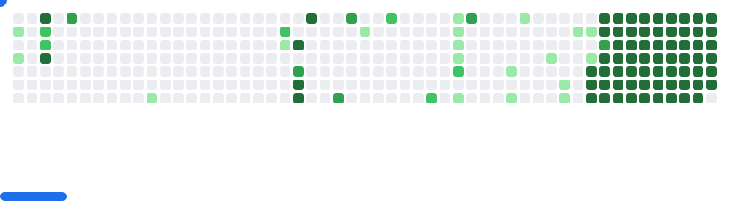

# Welcome, I'm Erick Diaz 👋

## About Me

I'm a frontend web developer passionate about creating clean, responsive, and user-friendly interfaces. I enjoy combining technology and design to build engaging digital experiences, mainly using React and Figma. I'm always exploring new tools and ideas to grow as a developer and designer.
 
- 👀 Passionate about building modern, responsive web interfaces with React and the latest frontend technologies.
- 🌱 Continuously exploring UI/UX principles, accessibility best practices, and user-centered design.
- 🌿 Committed to both personal and professional growth.
- ⌛ Interested in habits, productivity, and lifelong learning.

### Web Developer

## Technologies

  
  
  
  
  
  
  
  
  <!-- 
   -->
  
  
  
  
  
  
  <!-- 
   -->
  <!-- 
   -->
  <!-- 
   -->
  <!-- 
  
  
   -->
  
  
  
  
  
  
  <!-- 
  
  
   -->
  
  
  <!-- 
   -->
  
  
  
  
  <!-- 
   -->
  
  
  
  
  <!-- 
   -->
  

## Projects

- [Rick and Morty API](https://github.com/erickdc7/rickmorty-eddy)
- [Suikanime](https://github.com/erickdc7/Suikanime)
- [Cesar Vallejo Tribute](https://github.com/erickdc7/Cesar-Vallejo-Tribute)
- [Accesibilidad+](https://github.com/erickdc7/accesibilidad-plus)
- [Calcular Promedio](https://github.com/erickdc7/calcular-promedio)

## Links

## Contact

---

<picture>
  <source
    media="(prefers-color-scheme: dark)"
    srcset="images/breakout-dark.svg"
  />
  <source
    media="(prefers-color-scheme: light)"
    srcset="images/breakout-light.svg"
  />
  
</picture>
